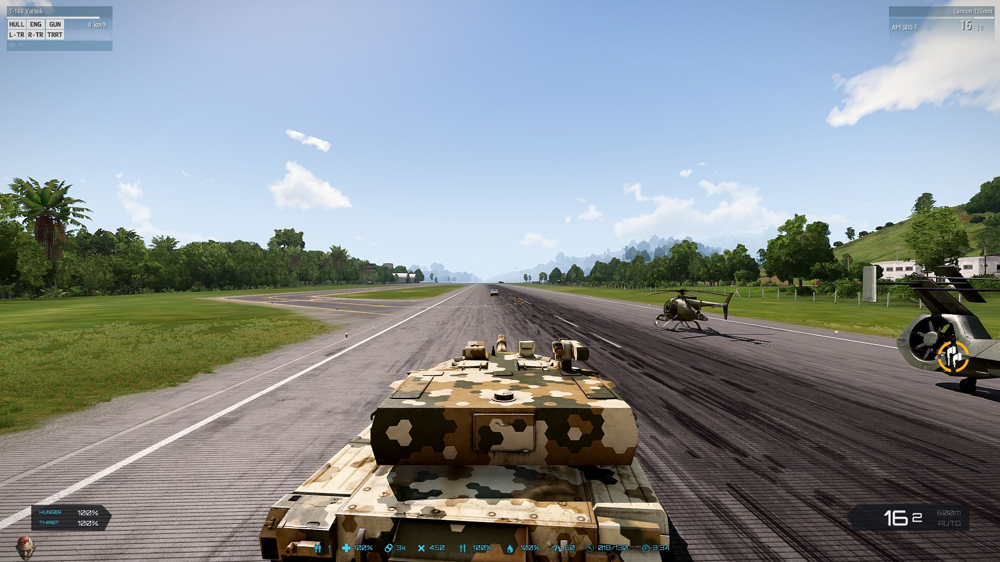

This is a script to enable the Arma 3 vanilla vehicle HUD in Arma 3 Exile

Note, this currently only works with very small interface size

Add the Custom folder to your mission file
Add the RscInGameUI.hpp to your mission file
Add the contents of description.ext to your own description.ext in your mission file
Add the contents of initPlayerLocal.sqf to your initPlayerLocal.sqf in your mission file, or if you do not have it, add it to your mission file
If you don't already have a custom folder for Exile client file edits, please add the addons/fixes folder and the ExileClient_gui_hud_renderGroupPanel.sqf file
In your config.cpp, in the CfgExileCustomCode code block, add the exception for the above file (see supplied)
Pack your mission file

If you have the time and/or patience to make this work with other interface sizes, feel free to create a pull request
Say thanks, buy me a beer or a pizza https://bit.ly/3gtPTkT
